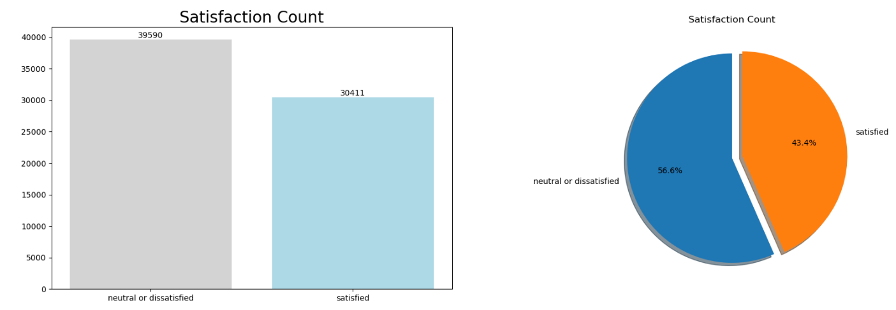
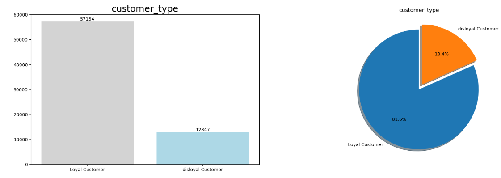
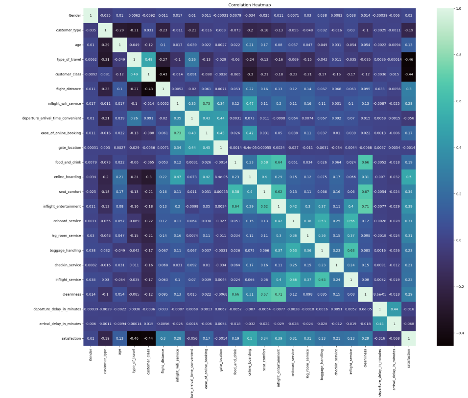
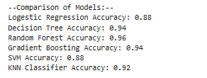
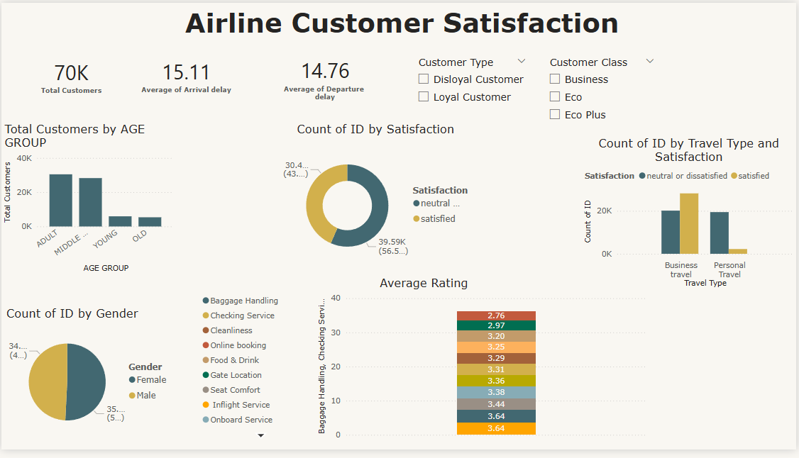

# Airline Passenger Satisfaction Prediction


## Overview

This project focuses on predicting airline passenger satisfaction using machine learning techniques. The goal is to analyze customer feedback and flight-related features to determine the likelihood of a passenger being satisfied with their experience. The insights derived from this model can help airlines improve customer service and operational efficiency.

## Features

- Data preprocessing and feature engineering
- Exploratory Data Analysis (EDA)
- Machine Learning model training and evaluation
- Visualization of key insights

## Technologies Used

- Python
- Jupyter Notebook
- Pandas, NumPy
- Scikit-learn
- Matplotlib, Seaborn, Plotly
- Machine Learning Algorithms (e.g., Logistic Regression, Random Forest, XGBoost, CatBoost)

## Installation

1. Clone the repository:
   ```bash
   git clone https://github.com/your-repo/airline-satisfaction.git
   ```
2. Navigate to the project directory:
   ```bash
   cd airline-satisfaction
   ```
3. Install dependencies:
   ```bash
   pip install -r requirements.txt
   ```

## Exploratory Data Analysis (EDA)

EDA was conducted to understand the patterns in passenger satisfaction:

- **Satisfaction Distribution:** The dataset contains both satisfied and dissatisfied passengers.
- **Impact of Flight Class:** Business class passengers are more likely to be satisfied than economy class passengers.
- **Service Ratings:** Higher ratings for in-flight service and cleanliness correlate with higher satisfaction levels.
- **Delay Analysis:** Longer delays are associated with lower satisfaction scores.
- **Feature Correlation:** Variables such as flight distance, seat comfort, and service rating strongly correlate with satisfaction.

### Key Visualizations

- **Satisfaction Distribution**
  
- **Customer Type**
  
- **Feature Correlation Heatmap**
  

## Model Training & Evaluation

Several machine learning models were trained and evaluated:

- **Algorithms Used:** Logistic Regression, Decision Tree, Random Forest, XGBoost, CatBoost, and others.
- **Best Performing Model:** Random Forest classifier achieved the highest accuracy.
- **Evaluation Metrics Used:** Confusion Matrix, ROC-AUC, Precision, Recall, and F1-score.

## Model Comparision
  

## Usage

1. Open the Jupyter Notebook:
   ```bash
   jupyter notebook
   ```
2. Load and run `Airline Passanger Satisfaction.ipynb`.
3. Follow the steps inside the notebook to preprocess data, train models, and evaluate results.

## Dataset

The dataset contains various customer feedback and flight-related features, such as seat comfort, in-flight service, cleanliness, flight distance, delay times, and travel class. Ensure the dataset is available in the appropriate location before running the notebook.

## PowerBI Dashboard



## Results

The trained model predicts passenger satisfaction based on flight experience data. The evaluation metrics, including accuracy, precision, recall, and F1-score, confirm the model's reliability in identifying satisfied and dissatisfied passengers.

## Contributions

Contributions are welcome! Feel free to open issues or submit pull requests.

## Contact

For any queries, reach out to suyashbargal@gmail.com.

